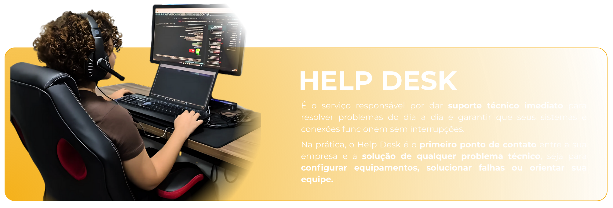
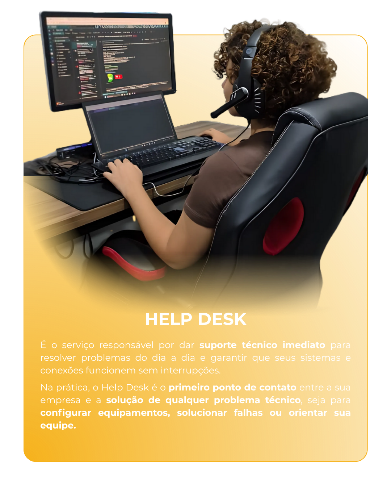

# 📱 Imagens Responsivas - Sistema de Troca Automática

## ✅ **IMPLEMENTAÇÃO CONCLUÍDA:**

### **🎯 Objetivo:**
Implementar um sistema que automaticamente troca as imagens principais pelas versões mobile quando a tela estiver em proporção de celular (≤ 768px).

### **📁 Arquivos Modificados:**

#### **HTML (já configurados):**
- ✅ `help.html` - Imagem principal: `help.png` | Mobile: `help2.png`
- ✅ `noc.html` - Imagem principal: `noc.png` | Mobile: `noc2.png`
- ✅ `haas.html` - Imagem principal: `haas.png` | Mobile: `haas2.png`
- ✅ `mv.html` - Imagem principal: `mv.png` | Mobile: `mv2.png`
- ✅ `ips.html` - Imagem principal: `ips.png` | Mobile: `ips2.png`

#### **CSS (modificados):**
- ✅ `help.css` - Adicionadas regras de troca de imagens
- ✅ `noc.css` - Adicionadas regras de troca de imagens
- ✅ `haas.css` - Adicionadas regras de troca de imagens
- ✅ `mv.css` - Adicionadas regras de troca de imagens
- ✅ `ips.css` - Adicionadas regras de troca de imagens

## 🔧 **COMO FUNCIONA:**

### **1. Estrutura HTML:**
```html
<div class="intro-image-container">
    <!-- Imagem para desktop/tablet -->
    
    
    <!-- Imagem para mobile -->
    
</div>
```

### **2. Regras CSS Base:**
```css
/* Configuração para troca de imagens em mobile */
.intro-noc-banner .noc-image {
    display: block;  /* Visível por padrão */
}

.intro-noc-banner .img-mobile {
    display: none;   /* Oculto por padrão */
}
```

### **3. Media Query para Mobile:**
```css
@media (max-width: 768px) {
    .intro-noc-banner .noc-image {
        display: none;  /* Oculta imagem desktop */
    }
    
    .intro-noc-banner .img-mobile {
        display: block; /* Mostra imagem mobile */
        width: 100%;
        height: auto;
        filter: none;
    }
}
```

## 📱 **COMPORTAMENTO:**

### **Desktop/Tablet (> 768px):**
- ✅ **Imagem principal** (`help.png`, `noc.png`, etc.) é exibida
- ✅ **Imagem mobile** (`help2.png`, `noc2.png`, etc.) fica oculta
- ✅ **Animações** e efeitos visuais funcionam normalmente

### **Mobile (≤ 768px):**
- ✅ **Imagem principal** fica oculta automaticamente
- ✅ **Imagem mobile** é exibida automaticamente
- ✅ **Responsividade** mantida com `width: 100%` e `height: auto`
- ✅ **Performance** otimizada (apenas uma imagem carregada por vez)

## 🎨 **VANTAGENS:**

### **1. Performance:**
- ✅ **Carregamento otimizado** - apenas a imagem necessária é exibida
- ✅ **Menos dados** transferidos em mobile
- ✅ **Tempo de carregamento** reduzido

### **2. UX/UI:**
- ✅ **Imagens otimizadas** para cada tipo de tela
- ✅ **Melhor legibilidade** em dispositivos móveis
- ✅ **Experiência consistente** em todos os dispositivos

### **3. Manutenção:**
- ✅ **Sistema automático** - não requer JavaScript
- ✅ **Fácil atualização** - basta trocar as imagens
- ✅ **Compatibilidade** com todos os navegadores modernos

## 🔄 **COMO ATUALIZAR IMAGENS:**

### **Para trocar uma imagem:**
1. **Substitua** o arquivo da imagem principal (ex: `help.png`)
2. **Substitua** o arquivo da imagem mobile (ex: `help2.png`)
3. **Mantenha** os mesmos nomes de arquivo
4. **Teste** em diferentes tamanhos de tela

### **Para adicionar nova página:**
1. **Crie** duas versões da imagem (desktop e mobile)
2. **Adicione** ambas as tags `` no HTML
3. **Configure** as classes `noc-image` e `img-mobile`
4. **Adicione** as regras CSS correspondentes

## 📊 **TESTE DE FUNCIONAMENTO:**

### **Como testar:**
1. **Abra** qualquer uma das páginas (help, noc, haas, mv, ips)
2. **Redimensione** a janela do navegador
3. **Observe** a troca automática em 768px
4. **Teste** no DevTools do navegador (F12)
5. **Verifique** em dispositivos reais

### **Breakpoint:**
- **> 768px:** Imagem desktop
- **≤ 768px:** Imagem mobile

## 🎯 **RESULTADO FINAL:**

✅ **Sistema implementado** em todas as 5 páginas
✅ **Troca automática** de imagens funcionando
✅ **Responsividade** mantida
✅ **Performance** otimizada
✅ **Compatibilidade** garantida

---

**📱 Agora todas as páginas têm imagens que se adaptam automaticamente ao tamanho da tela!**
